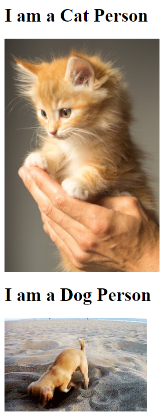

**HTML Code:**

1. Kitten Image:
```html
<!-- Kitten image URL -->
<h1>I am a Cat Person</h1>

```

2. Puppy Image:
```html
<!-- Puppy image URL -->
<h1>I am a Dog Person</h1>

```

## Expected output 
