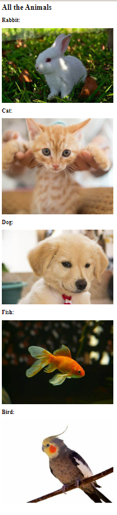

## Directory Structure

Here's an overview of the directory structure:

```
.
├── dog.png
├── Folder0
│   ├── Folder3
│   │   └── cat.png
│   ├── goal.png
│   ├── index.html
│   ├── rabbit.png
│   └── solution.html
└── Folder1
    ├── fish.png
    └── Folder2
        └── bird.png
```

This structure contains various image files and HTML files organized within different directories.


Certainly! Here's the HTML code for the provided sections and the expected content outputs:

## HTML Code:
```html
<h1>All the Animals</h1>
<h2>Rabbit:</h2>


<h2>Cat:</h2>


<h2>Dog:</h2>


<h2>Fish:</h2>


<h2>Bird:</h2>

```
## Expected output 
