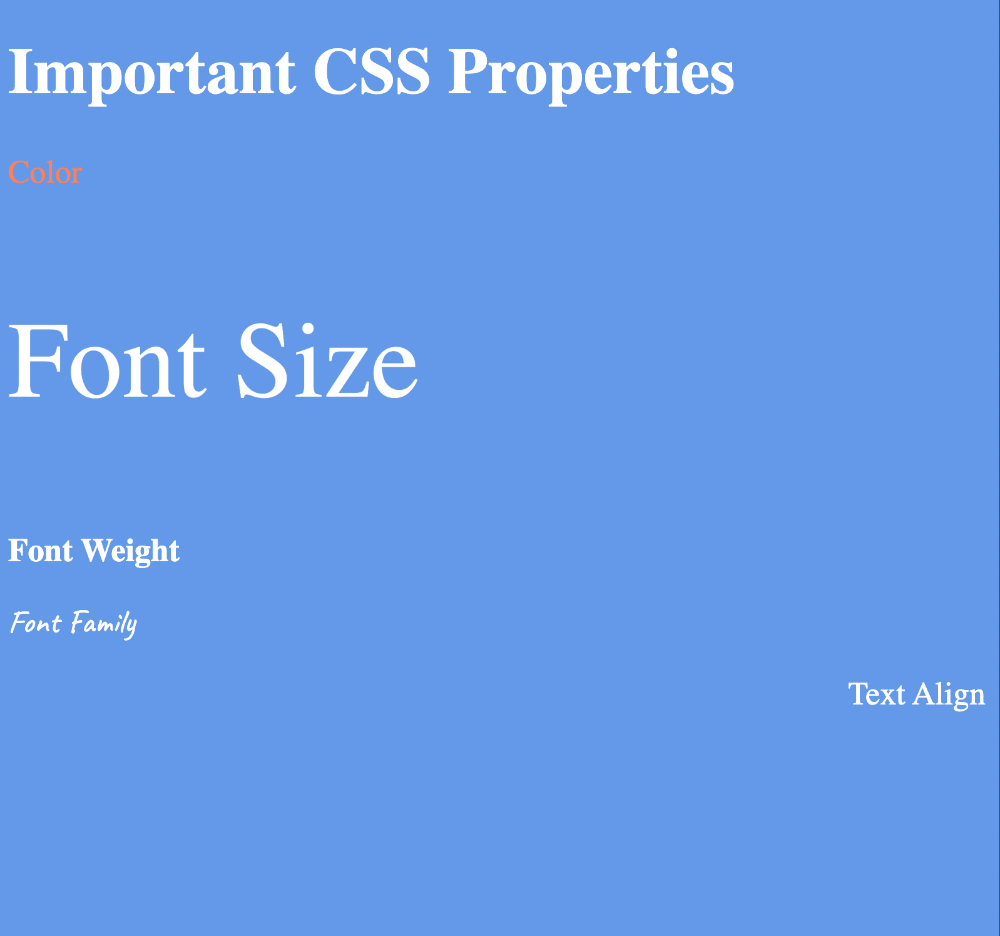

## Code Files

Here's the code you provided along with the expected content output:

```
<!DOCTYPE html>
<html lang="en" style="font-size: 30px;">

<head>
  <meta charset="UTF-8">
  <title>CSS Properties</title>
  <style>
    body {
      background-color: cornflowerblue;
      color: white;
      font-size: 18px;
    }

    /* Don't change the CSS above, add Your CSS below */

  </style>
</head>

<body>
  <h1>Important CSS Properties</h1>
  <p style="color: coral;">Color</p>
  <p style="font-size: 2rem;">Font Size</p>
  <p style="font-weight: 900;">Font Weight</p>
  <p style="font-family: 'Caveat', cursive;">Font Family</p>
  <p style="text-align: right;">Text Align</p>
</body>

</html>
```

## Expected output 


## Instructions from Angela

1. **Color (p)**: coral
2. **Font Size (p)**: 2X the size of the root font size
3. **Font Weight (p)**: 900
4. **Font Family (p)**: Google font Caveat with regular (400) font weight
5. **Text Align (p)**: Right Align
