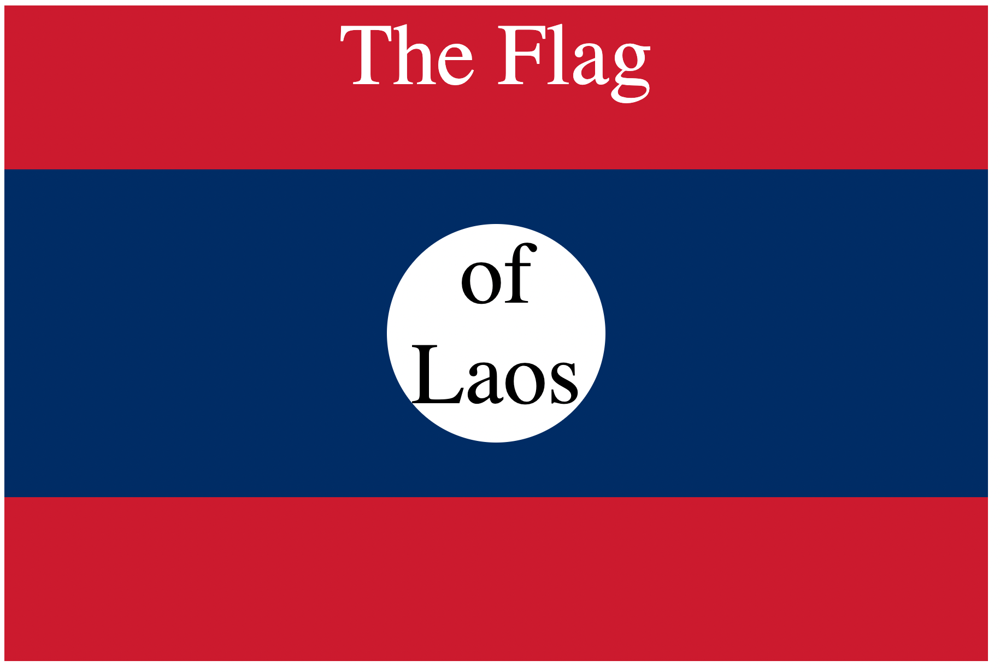

## Code Files
Here's the code you provided along with the expected content output:

```
<!DOCTYPE html>
<html lang="en">

<head>
  <meta charset="UTF-8">
  <title>CSS Flag Project</title>
  <style>
    /* Write your CSS Code here */
    
    .flag{
      background-color: #ce1126;
      height: 600px;
      width: 900px;
      position: relative;
      text-align: center;
      color: white;
      font-size: 500%;
    }

    div>div{
      background-color: #002868;
      height: 50%;
      width: 100%;
      position: absolute;
      top: 25%;
    }

    div>div>div{
      background-color: white;
      height: 200px;
      width: 200px; 
      border-radius: 50%;
      position: absolute;
      top: 50px;
      left: 350px;
    }

    .flag>div div p {
      color: black;
    }

    p{
      margin: 0px;
      padding: 0;
    }

   


  </style>
</head>

<!-- 
  IMPORTANT! Do not change any HTML
Don't add any classes/ids/elements 
Use what you know about combining selectors 
and CSS specificity instead.
Hint 1: The flag is 900px by 600px and the circle is 200px by 200px.
Hint 2: You can use CSS inspection to get the colors from
https://appbrewery.github.io/flag-of-laos/
-->

<body>
  <div class="flag">
    <p>The Flag</p>
    <div>
      <div>
        <p>of Laos</p>
      </div>
    </div>
  </div>
</body>

</html>
```

## Expected output 
