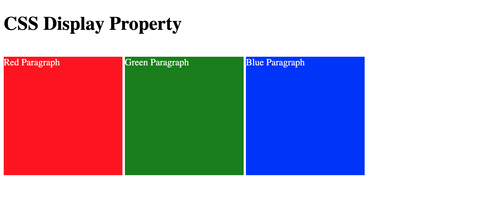

## Code Files
Here's the code you provided along with the expected content output:

**index**
```

<!DOCTYPE html>
<html>

<!-- 
  TODO
1. By changing only the display property of the CSS make all 3 squares line up horizontally like in goal1 image.
2. Change only the display property to make all 3 squares line up vertically like in goal2 image. 
-->

<head>
  <title>CSS Display Property Example</title>
  <style>
    p {
      color: white;
    }

    .red {
      display: inline-block;
      width: 200px;
      height: 200px;
      background-color: red;
    }

    .green {
      display: inline-block;
      width: 200px;
      height: 200px;
      background-color: green;
    }

    .blue {
      display: inline-block;
      width: 200px;
      height: 200px;
      background-color: blue;
    }
  </style>
</head>


<body>
  <h1>CSS Display Property</h1>
  <p class="red">Red Paragraph </p>
  <p class="green">Green Paragraph</p>
  <p class="blue">Blue Paragraph</p>
</body>

</html>
```

**index2**
```
<!DOCTYPE html>
<html>

<head>
  <title>CSS Display Property Example</title>
  <style>
    p {
      color: white;
    }

    .red {
      display: block;
      width: 200px;
      height: 200px;
      background-color: red;
    }

    .green {
      display: block;
      width: 200px;
      height: 200px;
      background-color: green;
    }

    .blue {
      display: block;
      width: 200px;
      height: 200px;
      background-color: blue;
    }
  </style>
</head>

<body>
  <h1>CSS Display Property</h1>
  <p class="red">Red Paragraph </p>
  <p class="green">Green Paragraph</p>
  <p class="blue">Blue Paragraph</p>


</body>

</html>
```

## Expected output 
- `index`

    


- `index2`

    