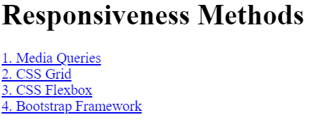
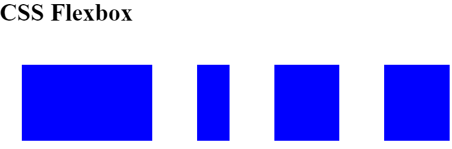
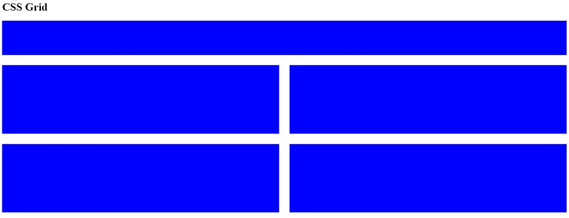
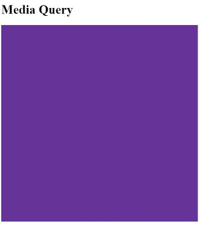

# Contents
1. [Index](#index)
2. [Bootstrap](#bootstrap)
3. [Flexbox](#flexbox)
4. [Grid](#grid)
5. [Media Query](#media-query)

## Index 

**code**
```
<!DOCTYPE html>
<html lang="en">

<head>
  <meta charset="UTF-8">
  <meta name="viewport" content="width=device-width, initial-scale=1.0">
  <title>Responsiveness</title>
  <style>
    a {
      display: block;
    }
  </style>
</head>

<body>
  <h1>Responsiveness Methods</h1>
  <a href="./media-query.html">1. Media Queries</a>
  <a href="./grid.html">2. CSS Grid</a>
  <a href="./flexbox.html">3. CSS Flexbox</a>
  <a href="./bootstrap.html">4. Bootstrap Framework</a>
</body>

</html>
```

#### output



## Bootstrap

**code**
```
<!DOCTYPE html>
<html lang="en">

<head>
  <meta charset="UTF-8">
  <meta name="viewport" content="width=device-width, initial-scale=1.0">
  <title>Bootstrap Framework</title>
  <link href="https://cdn.jsdelivr.net/npm/bootstrap@5.0.2/dist/css/bootstrap.min.css" rel="stylesheet"
    integrity="sha384-EVSTQN3/azprG1Anm3QDgpJLIm9Nao0Yz1ztcQTwFspd3yD65VohhpuuCOmLASjC" crossorigin="anonymous">
</head>

<body>
  <h1>Bootstrap Framework</h1>
  <div class="container">
    <div class="row">
      <div class="card col-6">
        Card
      </div>
      <div class="card col-2">
        Card
      </div>
      <div class="card col-4">
        Card
      </div>
    </div>
  </div>


</body>

</html>
```

#### output


## Flexbox

**code**
```
<!DOCTYPE html>
<html lang="en">

<head>
  <meta charset="UTF-8">
  <meta name="viewport" content="width=device-width, initial-scale=1.0">
  <title>CSS Flexbox</title>
  <style>
    .flex-container {
      display: flex;
    }

    .card {
      background: blue;
      border: 30px solid white;
      height: 100px;
      flex: 1;
    }

    .first {
      flex: 2;
    }

    .second {
      flex: 0.5;
    }
  </style>
</head>

<body>
  <h1>CSS Flexbox</h1>
  <div class="flex-container">
    <div class="first card"></div>
    <div class="second card"></div>
    <div class="card"></div>
    <div class="card"></div>
  </div>


</body>

</html>
```

#### output



## Grid

**code**
```
<!DOCTYPE html>
<html lang="en">

<head>
  <meta charset="UTF-8">
  <meta name="viewport" content="width=device-width, initial-scale=1.0">
  <title>CSS Grid</title>
  <style>
    .grid-container {
      display: grid;
      grid-template-columns: 1fr 1fr;
      grid-template-rows: 100px 200px 200px;
      gap: 30px;
    }

    .first {
      grid-column: span 2;
    }

    .card {
      background-color: blue;
    }
  </style>
</head>

<body>
  <h1>CSS Grid</h1>
  <div class="grid-container">
    <div class="first card"></div>
    <div class="card"></div>
    <div class="card"></div>
    <div class="card"></div>
    <div class="card"></div>
  </div>

</body>

</html>
```

#### output



## Media Query

**code**
```
<!DOCTYPE html>
<html lang="en">

<head>
  <meta charset="UTF-8">
  <meta name="viewport" content="width=device-width, initial-scale=1.0">
  <title>Media Query</title>
  <style>
    div {
      background-color: rebeccapurple;
      height: 500px;
      width: 500px;
    }

    @media (max-width: 600px) {

      /* CSS for screens below or equal to 600px wide */
      div {
        height: 200px;
        width: 200px;
      }
    }
  </style>
</head>

<body>
  <h1>Media Query</h1>
  <div></div>
</body>

</html>
```

#### output
