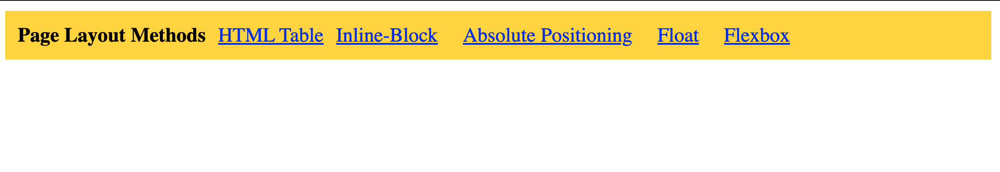
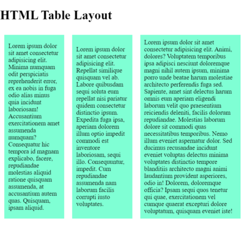
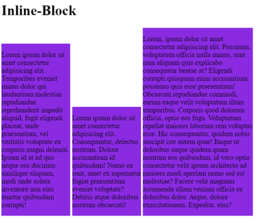
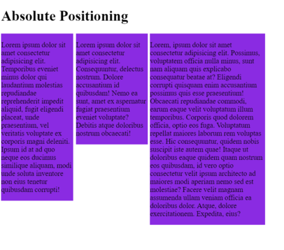
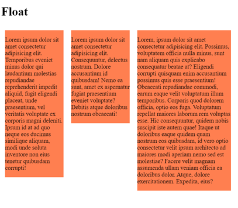
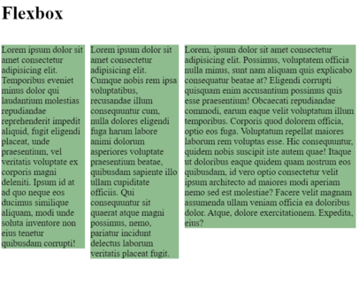

# Contents

1. [Index](#index)
2. [Html Table](#html-table)
3. [Inline](#inline)
4. [Absolute](#absolute)
5. [Float](#float)
6. [Flex](#flex)

# code

### index
```
<!DOCTYPE html>
<html lang="en">

<head>
  <meta charset="UTF-8">
  <meta name="viewport" content="width=device-width, initial-scale=1.0">
  <title>Column Layout Methods</title>
  <style>
    p {
      padding: 0;
      margin: 0;
      font-weight: 700;
    }

    li {
      list-style: none;
    }

    .container {
      padding: 10px;
      background-color: gold;
      display: inline-flex;
      gap: 1rem;
    }

  </style>
</head>

<body>
  <div class="container">
    <p>Page Layout Methods</p>

    <li><a href="./html-table.html">HTML Table</a></li>
    <li><a href="./inline-block.html">Inline-Block</li>
    <li><a href="./absolute-position.html">Absolute Positioning</li>
    <li><a href="./float.html">Float</li>
    <li><a href="./flex.html">Flexbox</li>

  </div>
</body>

</html>
```

## Html Table
```
<!DOCTYPE html>
<html lang="en">

<head>
  <meta charset="UTF-8">
  <meta name="viewport" content="width=device-width, initial-scale=1.0">
  <title>HTML Table Layout</title>
  <style>
    table {
      width: 100%;
    }

    td {
      border: 10px solid white;
      padding: 10px;
      background-color: aquamarine;
    }

    .col1 {
      width: 25%;
    }

    .col2 {
      width: 25%;
    }

    .col3 {
      width: 40%;
    }

    ;
  </style>
</head>

<body>
  <h1>HTML Table Layout</h1>
  <table>
    <tr class="row">
      <td class="col1">Lorem ipsum dolor sit amet consectetur adipisicing elit. Minima numquam odit perspiciatis
        reprehenderit error, ex ea nobis in fuga odio alias minus quia incidunt laboriosam! Accusantium exercitationem
        amet assumenda numquam? Consequatur hic tempora id magnam explicabo, facere, repudiandae molestias aliquid
        ratione quisquam assumenda, at accusantium autem quas. Quisquam, ipsam aliquid.</td>
      <td class="col2">Lorem ipsum dolor sit amet consectetur adipisicing elit. Repellat similique quisquam vel ab.
        Labore quibusdam sequi soluta eum repellat nisi pariatur quidem consectetur distinctio ipsum. Expedita fuga
        ipsa, aperiam dolorem illum optio impedit commodi est inventore laboriosam, sequi illo. Consequuntur, impedit.
        Cum repudiandae assumenda nam laborum facilis corrupti iusto voluptates.</td>
      <td class="col3">Lorem ipsum dolor sit amet consectetur adipisicing elit. Animi, dolores? Voluptatem temporibus
        ipsa adipisci nesciunt doloremque magni nihil autem ipsum, minima porro unde beatae harum molestiae architecto
        perferendis fuga sed. Sapiente, amet sint delectus harum omnis eum aperiam eligendi laborum velit quo
        praesentium reiciendis deleniti, facilis dolorum repudiandae. Molestias laborum dolore sit commodi quas
        necessitatibus temporibus. Nemo illum eveniet aspernatur dolor. Sed ducimus recusandae incidunt eveniet voluptas
        delectus minima voluptates distinctio tempore blanditiis architecto magni animi laudantium provident asperiores,
        odio in! Dolorem, doloremque officia? Ipsam sequi quos tenetur qui quae, exercitationem vel cumque quaerat
        excepturi dolore voluptatum, quisquam eveniet iste!</td>
    </tr>
  </table>

</body>

</html>
```

## Inline
```
<!DOCTYPE html>
<html lang="en">

<head>
  <meta charset="UTF-8">
  <meta name="viewport" content="width=device-width, initial-scale=1.0">
  <title>Inline Block</title>
  <style>
    div {
      display: inline-block;
      background-color: blueviolet;
    }

    .one {
      width: 25%;
    }

    .two {
      width: 25%;
    }

    .three {
      width: 40%;
    }
  </style>
</head>

<body>

  <body>
    <h1>Inline-Block</h1>
    <div class="one">
      <p>Lorem ipsum dolor sit amet consectetur adipisicing elit. Temporibus eveniet minus dolor qui laudantium
        molestias repudiandae reprehenderit impedit aliquid, fugit eligendi placeat, unde praesentium, vel veritatis
        voluptate ex corporis magni deleniti. Ipsum id at ad quo neque eos ducimus similique aliquam, modi unde soluta
        inventore non eius tenetur quibusdam corrupti!</p>
    </div>
    <div class="two">
      <p>Lorem ipsum dolor sit amet consectetur adipisicing elit. Consequuntur, delectus nostrum. Dolore accusantium id
        quibusdam! Nemo ea sunt, amet ex aspernatur fugiat praesentium eveniet voluptate? Debitis atque doloribus
        nostrum obcaecati!</p>
    </div>
    <div class="three">
      <p>Lorem, ipsum dolor sit amet consectetur adipisicing elit. Possimus, voluptatem officia nulla minus, sunt nam
        aliquam quis explicabo consequatur beatae at? Eligendi corrupti quisquam enim accusantium possimus quis esse
        praesentium! Obcaecati repudiandae commodi, earum eaque velit voluptatum illum temporibus. Corporis quod dolorem
        officia, optio eos fuga. Voluptatum repellat maiores laborum rem voluptas esse. Hic consequuntur, quidem nobis
        suscipit iste autem quae! Itaque ut doloribus eaque quidem quam nostrum eos quibusdam, id vero optio consectetur
        velit ipsum architecto ad maiores modi aperiam nemo sed est molestiae? Facere velit magnam assumenda ullam
        veniam officia ea doloribus dolor. Atque, dolore exercitationem. Expedita, eius?</p>
    </div>
  </body>

</html>
```

## Absolute
```
<!DOCTYPE html>
<html lang="en">

<head>
  <meta charset="UTF-8">
  <meta name="viewport" content="width=device-width, initial-scale=1.0">
  <title>Absolute Positioning</title>
  <style>
    div {
      position: relative;
      display: inline-block;
      background-color: blueviolet;
    }

    .one {
      width: 25%;
      position: absolute;
    }

    .two {
      position: absolute;
      left: 27.25%;
      width: 25%;
    }

    .three {
      position: absolute;
      left: 53%;
      width: 40%;
    }
  </style>
</head>

<body>

  <body>
<h1>Absolute Positioning</h1>
    <div class="one">
      <p>Lorem ipsum dolor sit amet consectetur adipisicing elit. Temporibus eveniet minus dolor qui laudantium
        molestias repudiandae reprehenderit impedit aliquid, fugit eligendi placeat, unde praesentium, vel veritatis
        voluptate ex corporis magni deleniti. Ipsum id at ad quo neque eos ducimus similique aliquam, modi unde soluta
        inventore non eius tenetur quibusdam corrupti!</p>
    </div>
    <div class="two">
      <p>Lorem ipsum dolor sit amet consectetur adipisicing elit. Consequuntur, delectus nostrum. Dolore accusantium id
        quibusdam! Nemo ea sunt, amet ex aspernatur fugiat praesentium eveniet voluptate? Debitis atque doloribus
        nostrum obcaecati!</p>
    </div>
    <div class="three">
      <p>Lorem, ipsum dolor sit amet consectetur adipisicing elit. Possimus, voluptatem officia nulla minus, sunt nam
        aliquam quis explicabo consequatur beatae at? Eligendi corrupti quisquam enim accusantium possimus quis esse
        praesentium! Obcaecati repudiandae commodi, earum eaque velit voluptatum illum temporibus. Corporis quod dolorem
        officia, optio eos fuga. Voluptatum repellat maiores laborum rem voluptas esse. Hic consequuntur, quidem nobis
        suscipit iste autem quae! Itaque ut doloribus eaque quidem quam nostrum eos quibusdam, id vero optio consectetur
        velit ipsum architecto ad maiores modi aperiam nemo sed est molestiae? Facere velit magnam assumenda ullam
        veniam officia ea doloribus dolor. Atque, dolore exercitationem. Expedita, eius?</p>
    </div>
  </body>

</html>
```
## Float
```
<!DOCTYPE html>
<html lang="en">

<head>
  <meta charset="UTF-8">
  <meta name="viewport" content="width=device-width, initial-scale=1.0">
  <title>Float</title>
  <style>
    div {
      background-color: coral;
      margin: 10px;
    }

    .one {
      float: left;
      width: 25%;
    }

    .two {
      width: 25%;
      float: left;
    }

    .three {
      float: left;
      width: 40%;
    }
  </style>
</head>

<body>

  <body>
    <h1>Float</h1>
    <div class="one">
      <p>Lorem ipsum dolor sit amet consectetur adipisicing elit. Temporibus eveniet minus dolor qui laudantium
        molestias repudiandae reprehenderit impedit aliquid, fugit eligendi placeat, unde praesentium, vel veritatis
        voluptate ex corporis magni deleniti. Ipsum id at ad quo neque eos ducimus similique aliquam, modi unde soluta
        inventore non eius tenetur quibusdam corrupti!</p>
    </div>
    <div class="two">
      <p>Lorem ipsum dolor sit amet consectetur adipisicing elit. Consequuntur, delectus nostrum. Dolore accusantium id
        quibusdam! Nemo ea sunt, amet ex aspernatur fugiat praesentium eveniet voluptate? Debitis atque doloribus
        nostrum obcaecati!</p>
    </div>
    <div class="three">
      <p>Lorem, ipsum dolor sit amet consectetur adipisicing elit. Possimus, voluptatem officia nulla minus, sunt nam
        aliquam quis explicabo consequatur beatae at? Eligendi corrupti quisquam enim accusantium possimus quis esse
        praesentium! Obcaecati repudiandae commodi, earum eaque velit voluptatum illum temporibus. Corporis quod dolorem
        officia, optio eos fuga. Voluptatum repellat maiores laborum rem voluptas esse. Hic consequuntur, quidem nobis
        suscipit iste autem quae! Itaque ut doloribus eaque quidem quam nostrum eos quibusdam, id vero optio consectetur
        velit ipsum architecto ad maiores modi aperiam nemo sed est molestiae? Facere velit magnam assumenda ullam
        veniam officia ea doloribus dolor. Atque, dolore exercitationem. Expedita, eius?</p>
    </div>
  </body>

</html>
```

## Flex
```
<!DOCTYPE html>
<html lang="en">

<head>
  <meta charset="UTF-8">
  <meta name="viewport" content="width=device-width, initial-scale=1.0">
  <title>Flexbox</title>
  <style>
    .container {
      display: flex;
      gap: 10px;
    }

    p {
      background-color: darkseagreen;
    }
  </style>
</head>

<body>

  <body>
    <h1>Flexbox</h1>
    <div class="container">
      <div class="one">
        <p>Lorem ipsum dolor sit amet consectetur adipisicing elit. Temporibus eveniet minus dolor qui laudantium
          molestias repudiandae reprehenderit impedit aliquid, fugit eligendi placeat, unde praesentium, vel veritatis
          voluptate ex corporis magni deleniti. Ipsum id at ad quo neque eos ducimus similique aliquam, modi unde soluta
          inventore non eius tenetur quibusdam corrupti!</p>
      </div>
      <div class="two">
        <p>Lorem ipsum dolor sit amet consectetur adipisicing elit. Cumque nobis rem ipsa voluptatibus, recusandae illum
          consequuntur cum, nulla dolores eligendi fuga harum labore animi dolorum asperiores voluptate praesentium
          beatae, quibusdam sapiente illo ullam cupiditate officiis. Qui consequuntur sit quaerat atque magni possimus,
          nemo, pariatur incidunt delectus laborum veritatis placeat fugit.</p>
      </div>
      <div class="three">
        <p>Lorem, ipsum dolor sit amet consectetur adipisicing elit. Possimus, voluptatem officia nulla minus, sunt nam
          aliquam quis explicabo consequatur beatae at? Eligendi corrupti quisquam enim accusantium possimus quis esse
          praesentium! Obcaecati repudiandae commodi, earum eaque velit voluptatum illum temporibus. Corporis quod
          dolorem
          officia, optio eos fuga. Voluptatum repellat maiores laborum rem voluptas esse. Hic consequuntur, quidem nobis
          suscipit iste autem quae! Itaque ut doloribus eaque quidem quam nostrum eos quibusdam, id vero optio
          consectetur
          velit ipsum architecto ad maiores modi aperiam nemo sed est molestiae? Facere velit magnam assumenda ullam
          veniam officia ea doloribus dolor. Atque, dolore exercitationem. Expedita, eius?</p>
      </div>
    </div>
  </body>

</html>
```

# outputs





