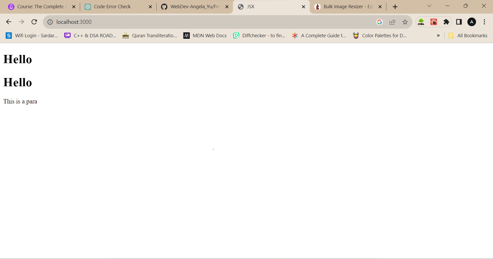

# This file shows the approximate structure of a react application folder sysytem
```
.
├── node_modules
├── package-lock.json
├── package.json
├── public
│   └── index.html
├── README.md
├── src
│   ├── App.js
│   ├── index.js
│   └── styles.css
└── README.md
```

# goal
