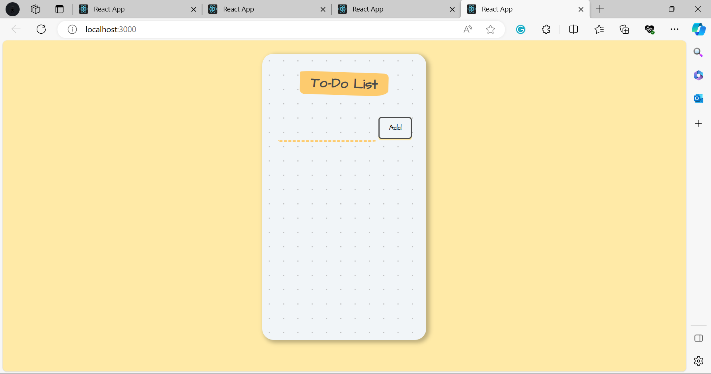

# Explanation
The provided code represents a simple to-do list application in React. Let's break down the code step by step:

1. **Importing Dependencies**:
   - React and ReactDOM libraries are imported to create and render React components.
   - The `App` component is imported from the "./components/App" file.
   - The `ToDoItem` component is imported from the "./ToDoItem" file.

2. **Rendering the App**:
   - The `ReactDOM.render` function is used to render the `App` component, which will be injected into the HTML element with the ID "root." This is how the React application gets mounted to the DOM.

3. **App Component**:
   - The `App` component is defined using a functional component.

4. **State Management**:
   - Two pieces of state are managed using the `useState` hook:
     - `inputText`: Stores the text entered by the user in the input field.
     - `items`: An array that holds the to-do list items.

5. **handleChange Function**:
   - This function is called whenever the user types in the input field.
   - It updates the `inputText` state with the new value from the input field.

6. **addItem Function**:
   - This function is called when the "Add" button is clicked.
   - It updates the `items` state by appending the current `inputText` to the existing items array.
   - After adding the item, it clears the input field by setting `inputText` to an empty string.

7. **deleteItem Function**:
   - This function is used to delete a to-do list item.
   - It is called when a user clicks on a to-do list item.
   - It updates the `items` state by filtering out the item with the specified `id`. In this case, it's using the index of the item in the array.

8. **Rendering JSX**:
   - The `render` method of the `App` component returns JSX (HTML-like code) that defines the structure of the to-do list app.
   - The input field and the "Add" button are part of a form within the `form` element.
   - The `map` function is used to render each item in the `items` array as a `ToDoItem` component.
   - For each to-do item, it passes the `id`, `text`, and the `deleteItem` function as props to the `ToDoItem` component.

9. **ToDoItem Component**:
   - The `ToDoItem` component is a simple functional component that represents each to-do list item.
   - When a user clicks on a to-do item, it calls the `onChecked` function with the item's `id` as an argument.

In summary, this code creates a basic to-do list application with the ability to add and delete items. It uses React's state management to keep track of the input value and the list of items. The code structure follows React's best practices for managing state and rendering components.