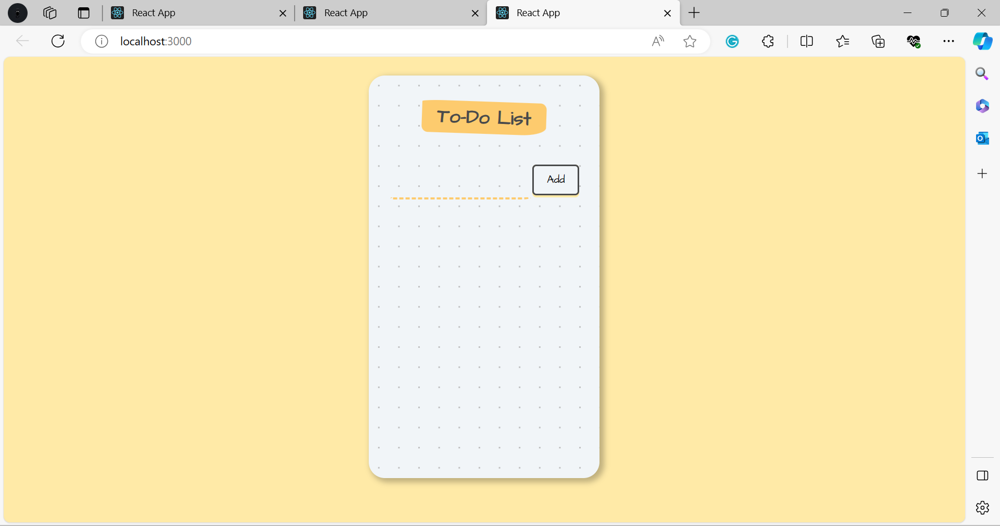

# Explanation
In the provided code, you have a simple To-Do List application built with React. The code is organized into three components: `App`, `InputArea`, and `ToDoItem`. Here's how the components work together:

1. **`App` Component**:
   - This is the top-level component for the To-Do List application.
   - It manages the state of the To-Do items using the `items` state variable, which is initialized as an empty array.
   - It defines two functions:
     - `addItem(inputText)`: This function is used to add a new item to the list. It takes the `inputText` as a parameter and updates the `items` state by appending the new item to the existing list of items.
     - `deleteItem(id)`: This function is used to delete an item from the list. It filters the `items` array, removing the item with the specified `id`.
   - The `App` component renders the following elements:
     - The heading "To-Do List."
     - The `InputArea` component, which is responsible for capturing user input and adding new items.
     - A list of To-Do items, each rendered as a `ToDoItem` component.

2. **`InputArea` Component**:
   - This component is responsible for capturing user input and adding new items to the To-Do list.
   - It manages the state of the `inputText` variable using the `useState` hook, which is initially an empty string.
   - The `handleChange` function is called when the user types in the input field. It updates the `inputText` state with the new input value.
   - The component renders an input field and a button for adding new items.
   - When the "Add" button is clicked, the `onAdd` prop function (passed from the `App` component) is called with the current `inputText` value, and the input field is cleared.

3. **`ToDoItem` Component**:
   - This component represents individual To-Do items in the list.
   - When a user clicks on a To-Do item, the `onClick` event triggers the `onChecked` function (passed as a prop from the `App` component), which removes the item from the list based on its `id`.