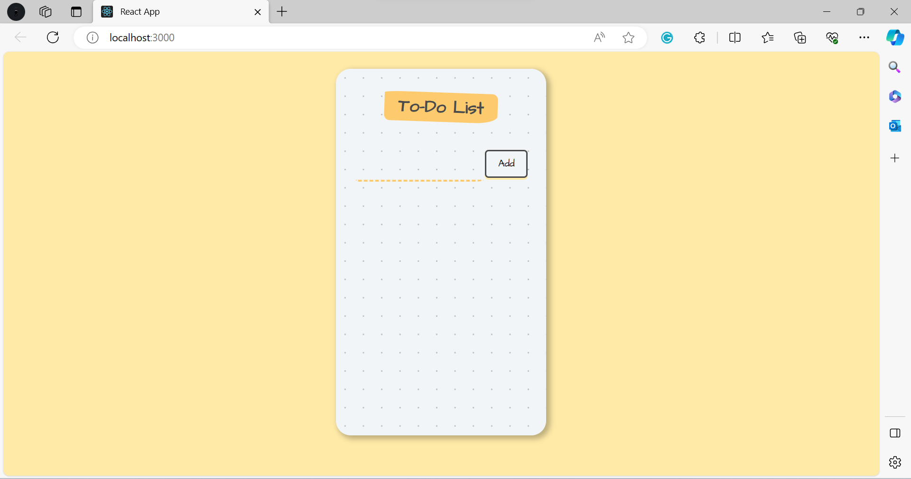

# Explanation
These code snippets are part of a simple To-Do List application built using React. The code is divided into three components: `App`, `InputArea`, and `ToDoItem`. Here's an explanation of each part:

**1. `Index` Component:**
```javascript
import React from "react";
import ReactDOM from "react-dom";
import App from "./components/App";

ReactDOM.render(<App />, document.getElementById("root"));
```
- This part is the entry point for the application. It renders the `App` component to a DOM element with the `id` "root." This is where the entire To-Do List application is mounted.

**2. `App` Component:**
```javascript
import React, { useState } from "react";
import ToDoItem from "./ToDoItem";
import InputArea from "./InputArea";

function App() {
  const [items, setItems] = useState([]);

  function addItem(inputText) {
    setItems((prevItems) => {
      return [...prevItems, inputText];
    });
  }

  function deleteItem(id) {
    setItems((prevItems) => {
      return prevItems.filter((item, index) => {
        return index !== id;
      });
    });
  }

  return (
    <div className="container">
      <div className="heading">
        <h1>To-Do List</h1>
      </div>
      <InputArea onAdd={addItem} />
      <div>
        <ul>
          {items.map((todoItem, index) => (
            <ToDoItem
              key={index}
              id={index}
              text={todoItem}
              onChecked={deleteItem}
            />
          ))}
        </ul>
      </div>
    </div>
  );
}

export default App;
```
- The `App` component is the main component of the To-Do List application.
- It uses the `useState` hook to manage the state of To-Do items, initializing the `items` state as an empty array.
- It defines two functions:
   - `addItem(inputText)`: This function is used to add a new item to the list. It takes the `inputText` as a parameter and updates the `items` state by appending the new item to the existing list of items.
   - `deleteItem(id)`: This function is used to delete an item from the list. It filters the `items` array, removing the item with the specified `id`.
- The component renders a heading, an `InputArea` component for adding new items, and a list of To-Do items rendered using the `ToDoItem` component.

**3. `InputArea` Component:**
```javascript
import React, { useState } from "react";

function InputArea(props) {
  const [inputText, setInputText] = useState("");

  function handleChange(event) {
    const newValue = event.target.value;
    setInputText(newValue);
  }

  return (
    <div className="form">
      <input onChange={handleChange} type="text" value={inputText} />
      <button
        onClick={() => {
          props.onAdd(inputText);
          setInputText("");
        }}
      >
        <span>Add</span>
      </button>
    </div>
  );
}

export default InputArea;
```
- The `InputArea` component is responsible for capturing user input and adding new items to the To-Do list.
- It uses the `useState` hook to manage the state of the `inputText` variable, which is initially an empty string.
- The `handleChange` function is called when the user types in the input field. It updates the `inputText` state with the new input value.
- The component renders an input field and a button for adding new items. When the "Add" button is clicked, it calls the `onAdd` prop function with the current `inputText` value and clears the input field.

**4. `ToDoItem` Component:**
```javascript
import React from "react";

function ToDoItem(props) {
  return (
    <div
      onClick={() => {
        props.onChecked(props.id);
      }}
    >
      <li>{props.text}</li>
    </div>
  );
}

export default ToDoItem;
```
- The `ToDoItem` component represents individual To-Do items in the list.
- When a user clicks on a To-Do item, the `onClick` event triggers the `onChecked` function (passed as a prop from the `App` component), which removes the item from the list based on its `id`.

These code snippets together create a simple To-Do List application with the ability to add and delete items, and the `InputArea` component allows users to input new To-Do items.


# Output 
